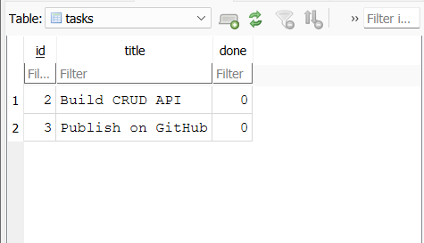

# Task API

A simple To-Do CRUD API built with Python, FastAPI, and SQLite.

The API stores tasks in a SQLite database instead of keeping them only in memory. This means tasks remain saved even after the API server is restarted.

## Requirements

- Python 3.10+
- FastAPI
- Uvicorn
- SQLite

## Installation

Create a virtual environment:

```bash
python -m venv venv
```

Activate the virtual environment on Windows:

```bash
venv\Scripts\activate
```

Install dependencies:

```bash
pip install fastapi uvicorn
```

## Database

The API uses SQLite for persistent task storage.

The database file is:

```text
tasks.db
```

It is stored in the project folder:

```text
task-api/
├── main.py
├── tasks.db
├── README.md
└── swagger.png
```

The `tasks` table contains:

| Column | Type | Description |
|---|---|---|
| `id` | INTEGER | Unique task ID |
| `title` | TEXT | Task title |
| `done` | BOOLEAN | Whether the task is completed |

The database and table are created automatically when the API starts if they do not already exist.

## Run the API

Start the server:

```bash
uvicorn main:app --reload
```

The API will run at:

```text
http://127.0.0.1:8000
```

Swagger UI is available at:

```text
http://127.0.0.1:8000/docs
```

## Endpoints

| Method | Endpoint | Description |
|---|---|---|
| GET | `/` | API information |
| GET | `/health` | Check API health |
| GET | `/tasks` | Get all tasks |
| GET | `/tasks/{id}` | Get a task by ID |
| POST | `/tasks` | Create a new task |
| PUT | `/tasks/{id}` | Update a task |
| DELETE | `/tasks/{id}` | Delete a task |

## Example

Create a task:

```bash
curl -X POST "http://127.0.0.1:8000/tasks" ^
-H "Content-Type: application/json" ^
-d "{\"title\":\"Buy milk\"}"
```

Example response:

```json
{
  "id": 4,
  "title": "Buy milk",
  "done": false
}
```

## SQLite Example

The database can be opened using DB Browser for SQLite.

Example query:

```sql
SELECT * FROM tasks;
```

This query returns all tasks stored in the SQLite database.

Another example:

```sql
SELECT * FROM tasks WHERE done = 1;
```

This returns only completed tasks.

## Swagger UI

The API can also be tested using FastAPI Swagger UI:

http://127.0.0.1:8000/docs


## Database Screenshot

The SQLite database was inspected using DB Browser for SQLite.

