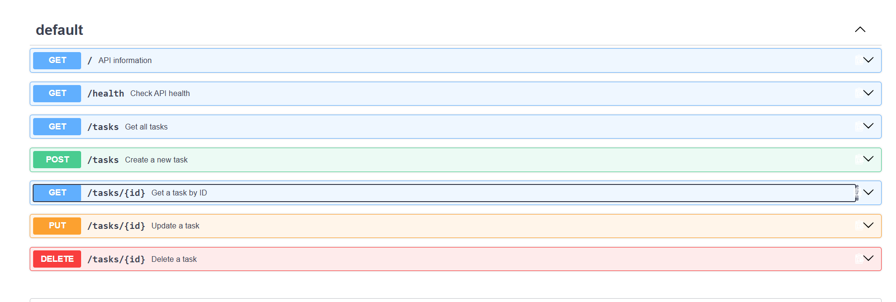

# Task API

A simple in-memory To-Do CRUD API built with Python and FastAPI.

## Requirements

- Python 3.10+
- FastAPI
- Uvicorn

## Installation

Create a virtual environment:

```bash
python -m venv venv
```

Activate the virtual environment on Windows:

```bash
venv\Scripts\activate
```

Install dependencies:

```bash
pip install fastapi uvicorn
```

## Run the API

Start the server:

```bash
uvicorn main:app --reload
```

The API will run at:

```text
http://127.0.0.1:8000
```

Swagger UI is available at:

```text
http://127.0.0.1:8000/docs
```

## Endpoints

| Method | Endpoint | Description |
|---|---|---|
| GET | `/` | API information |
| GET | `/health` | Check API health |
| GET | `/tasks` | Get all tasks |
| GET | `/tasks/{id}` | Get a task by ID |
| POST | `/tasks` | Create a new task |
| PUT | `/tasks/{id}` | Update a task |
| DELETE | `/tasks/{id}` | Delete a task |

## Example

Create a task:

```bash
curl -X POST "http://127.0.0.1:8000/tasks" ^
-H "Content-Type: application/json" ^
-d "{\"title\":\"Buy milk\"}"
```

Example response:

```json
{
  "id": 4,
  "title": "Buy milk",
  "done": false
}
```

## Test Output

Example `curl -i` response:

```text
HTTP/1.1 200 OK
date: Wed, 16 Sep 2026 10:35:21 GMT
server: uvicorn
content-length: 144
content-type: application/json

[{"id":1,"title":"Learn FastAPI","done":false},{"id":2,"title":"Build CRUD API","done":false},{"id":3,"title":"Publish on GitHub","done":false}]
```

## Swagger UI

The API can also be tested using FastAPI Swagger UI:

http://127.0.0.1:8000/docs

